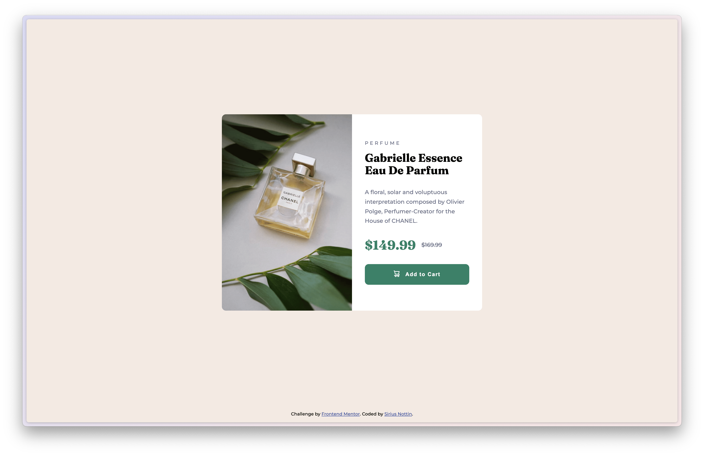

# Frontend Mentor - Product preview card component solution

This is a solution to the [Product preview card component challenge on Frontend Mentor](https://www.frontendmentor.io/challenges/product-preview-card-component-GO7UmttRfa). Frontend Mentor challenges help you improve your coding skills by building realistic projects. 

## Table of contents

- [Frontend Mentor - Product preview card component solution](#frontend-mentor---product-preview-card-component-solution)
  - [Table of contents](#table-of-contents)
  - [Overview](#overview)
    - [The challenge](#the-challenge)
    - [Screenshot](#screenshot)
    - [Links](#links)
    - [Built with](#built-with)
    - [What I learned](#what-i-learned)
    - [Continued development](#continued-development)
  - [Author](#author)
  - [Acknowledgments](#acknowledgments)

## Overview

### The challenge

Users should be able to:

- View the optimal layout depending on their device's screen size
- See hover and focus states for interactive elements

### Screenshot

### Links

- Solution URL: [github.com/siriusnottin/product-preview-card-component](https://github.com/siriusnottin/product-preview-card-component)
- Live Site URL: [siriusnottin.github.io/product-preview-card-component/](https://siriusnottin.github.io/product-preview-card-component/)

### Built with

- Semantic HTML5 markup
- CSS custom properties
- CSS Grid
- Flexbox

### What I learned

How to right semantic HTML, work on responsive in addition to nested CSS rules.
Work on a real project with a  provided design.

### Continued development

I'll keep on working on similar projects, focusing on responsive design. I also want to work on my CSS skills, especially on CSS Grid and Flexbox.

## Author

- Website - [Sirius Nottin](https://nottin.me)
- Frontend Mentor - [@siriusnottin](https://www.frontendmentor.io/profile/siriusnottin)
- X.com (Twitter) - [@siriusnottin](https://www.x.com/siriusnottin)
- LinkedIn - [@siriusnottin](https://www.linkedin.com/in/siriusnottin)

## Acknowledgments

Thanks to [Katy_v4](https://www.twitch.tv/katy_v4)'s community, particularly the [Brief of the Week](https://briefweek.fr/) challenge, which was originally launched on her [Discord community](https://discord.gg/NUFFgHC3xs), that I started last week. It helped me a lot to get through my imposter's syndrome, and allowed me to work on real projects with real deadlines.
